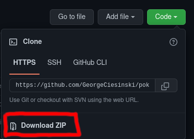
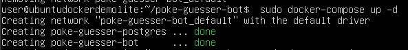
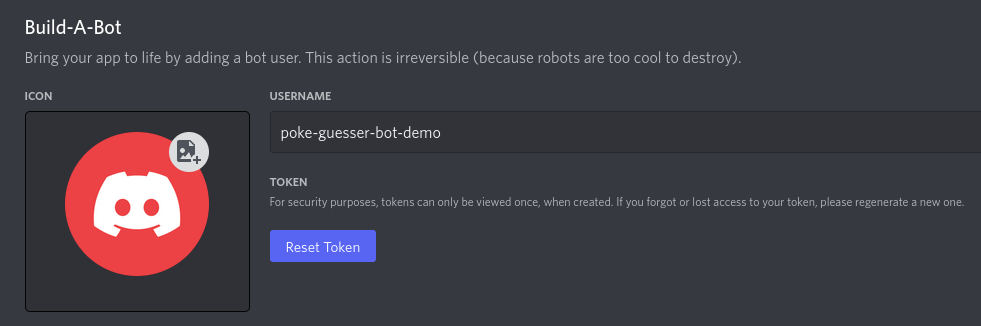

# Poké-guesser Bot

Poké-guesser Bot is a discord bot which selects random pokémon and asks the user to guess the pokémon name. The bot automatically tracks the score of participating users. It also recognizes a number of admin commands, and player commands such as catching pokémon, and displaying the leaderboard. 

## Repositories

Poké-guesser Bot is hosted on Github and Replit. To visit the repositories, see the links below.

1. Github - https://github.com/GeorgeCiesinski/poke-guesser-bot

2. Replit - https://replit.com/@GeorgeKhan/poke-guesser-bot

## Background

A few months ago, one of my friends Pokketmuse reached out to me about a coding idea. He is a Twitch streamer who has a discord server where he runs a few custom events for the users in the channel. One of these events is a Pokémon Guessing game he ran on pen & paper. In a nutshell, the game was to guess a daily pokémon, and the players were tracked on a leaderboard. He wanted a bot that could automate this process.

I fell in love with this idea immediately. I have wanted to build a discord bot for a very long time. I also have wanted to apply my JavaScript knowledge for a while as well as I have not completed any javascript projects yet. This project gave me an opportunity to kill two birds with one stone!

# Features

## Admins

Everyone with `ADMINISTRATOR`-Permission and the Server Owner is considered a Bot Admin.

## Mod Role Configuration

You can set one or more roles to moderate the bot. Setting no roles leaves mod commands and controls open for all server users.

## Channel configuration

You can set which channels the bot is allowed to reply in. Setting no channels allows the bot to listen and reply on all channels.

## Multi-language Support

Poké-guesser Bot supports guesses containing pokemon names in other languages as supported by Poké-API. This makes it great for an international discord server with players from many different regions.

## Dynamic Leaderboard

Poké-guesser Bot keeps track of scores and generates a nice looking leaderboard 

## Player commands

Besides the usual admin commands, there are also many player commands which can be used to get the leaderboard, get their own or another player's score, guess pokemon, and more. 

## Hosted by YOU on Docker

You can clone this repository to run it yourself through Docker Compose so you know exactly what this bot is doing. You can also make any custom modifications you want!

To run the bot you just need to run `sudo docker-compose up -d` (or if that doesn't work because it picks up the `.env` instead of `docker.env`, run `sudo docker-compose --env-file docker.env up -d`)

# Usage

## Commands

Poke-guesser bot recognizes commands from Mods (make sure that you add the role first!) which are for moderating the bot. It also recognizes regular player commands for playing the game.

### Admin Commands

Full list of admin commands is shown below. Do not type the < > characters.

`/settings mods show`: Shows all Mod Roles/Users.

`/settings mods add <mentionable>`: Add an Mod Role/User.

`/settings mods remove <mentionable>`: Remove an Mod Role/User.

`/settings mods help`: Shows help for `/settings mods`-Subcommands.

`/settings channels show`: Shows all allowed Channels.

`/settings channels add <channel>`: Add an allowed Channel.

`/settings channels remove <channel>`: Remove an allowed Channel.

`/settings channels help`: Shows help for `/settings channels`-Subcommands.

`/settings language show`: Shows currently configured language.

`/settings language set`: Set an language.

`/settings language unset`: Unset an language (Resets to en_US).

`/settings language help`: Shows help for `/settings language`-Subcommands.

`/settings reset`: Reset all Settings.

`/settings show`: Shows currently configured settings. (TODO: Not implemented yet)

`/settings help`: Shows help for `/settings`-Subcommands.

### Mod Commands

Full list of mod commands is shown below. Do not type the < > characters.

`/mod score add <user> <score>`: (caution) Adds the specified amount of points to a user.

`/mod score remove <user> <score>`: (caution) Removes the specified amount of points from a user.

`/mod score set <user> <score>`: (caution) Set the specified amount of points of a user.

`/mod score add <user>`: (caution) Adds the user to the leaderboard with 0 points. Cannot be used if the user is already on leaderboard.

`/mod score remove <user>`: Removes a user from the leaderboard.

`/mod score set <user>`: Resets the score of a user to 0.

<!-- TODO: delay, timeout, championship subcommands -->
<!-- `!new championship`: (caution) Outputs the Leaderboard one last time, reveals winner, and starts new championship with a blank leaderboard. -->

### Player Commands

Player commands have the prefix `$`

Full list of player commands is shown below. Do not include the < > characters. 

`/help <type:admin|mod|player>`: Shows Admin, Mod and Player commands. 

`/catch <pokemon-name>`: Allows player to guess the pokémon. Guessing correctly adds the player to the leaderboard and adds one point.

`/leaderboard`: Shows a leaderboard of top players.

`/score show`: See your current score and position.

*Note: The below command requires you to use @user mentions*

`/score show <user>`: See another user's score and position.

# Installation

## Forking and Running Bot using Replit

This bot was intented to run locally so my installation instructions will cover this method.

**Important:** *You must have already set up a Discord bot on the Discord Developer portal. If you haven't, follow the instructions in [this](#setup-discord-bot) section first.*

1. Go to the [Github link](https://github.com/GeorgeCiesinski/poke-guesser-bot/) for the project (You probably already did because you're reading this)

2. Two options:
    1. Click `Code` and then `Download ZIP` to download it as zip to your local machine, extract it and go in there.

        
    2. If you have `git` installed on your system you can just do `git clone https://github.com/GeorgeCiesinski/poke-guesser-bot.git` and `cd poke-guesser-bot`

        

3. Fill out the `example.env` file and rename it to `.env` (plus copy the `.env` to `docker.env` if you want to use Docker Compose). By default you just need to edit the options of `TOKEN`, `POSTGRES_HOST` (`db` when using Docker-Compose), `POSTGRES_USER` and `POSTGRES_PASSWORD`. If you want to change the database name from `pokebot` to something else, you'd also have to edit the file `docker-sql-init.sql`.

4. There are two options to run the bot:
    1. With Docker Compose: `sudo docker-compose up -d` (or if that doesn't work: `sudo docker-compose --env-file docker.env up -d`)
    
        
    2. Without Docker Compose (Make sure you configured the database properly): `node index.js` or `npm start`

## Setup Discord Bot

In order to use Poke-guesser-bot, you need to setup a discord bot first using the Discord Developer Portal.

1. Login to the Discord Developer portal and create a bot using [these instructions](https://discordjs.guide/preparations/setting-up-a-bot-application.html#creating-your-bot).

2. Click `Reset Token`, confirm, enter the 2FA auth code, click `Submit`

2. Copy the token by clicking the `Copy` button. Save this for a future step.

3. Click on `OAuth2` in the navbar on the left, then click URL Generator. There you need to select the scopes bot and applications.commands.

4. Scroll down to the bot permissions. Select the permissions from the below screenshot.

5. Click `Copy` below the bot permissions, and paste it into your browser.

6. Choose a server to invite the bot to, then click `Authorize`.

## Running locally

This bot was written to run locally or on docker with NodeJS and PostgreSQL and uses Env-Files for the senstive data that will get loaded in NodeJS as Environment Variables.

# Technology

## PostgreSQL

We used Postgres for our database.

## node.js

This project is written entirely using JavaScript in the [Node.JS](https://nodejs.org/en/) runtime environment. 

## discord.js

All interactions with discord were handled thanks to the [discord.js](https://discord.js.org/#/) library.

## API

This bot would not be possible without [PokeAPI](https://pokeapi.co/). This API provided a list of all pokémon, including their variants, as well as sprites that were instrumental in building this Poke-guesser Bot.

# Contributions

To contribute to the bot, please fork this repository and open up a pull request to merge changes back into the repository.

If your change adds a feature, please include proof that the feature is working as intended. Make sure you also test the bot to ensure other features aren't broken. I will expand this section soon to be more detailed, and add Pull Request templates to follow as well.

# License

[MIT](https://choosealicense.com/licenses/mit/)

# Additional Credit

Code Contributions by [Wissididom](https://github.com/Wissididom)

Replit Cover Image by [PIRO4D](https://pixabay.com/users/piro4d-2707530/) from [Pixabay](https://pixabay.com)

Leaderboard Image by [Aurelia Candeloro](https://www.instagram.com/aurelia.borealis)
