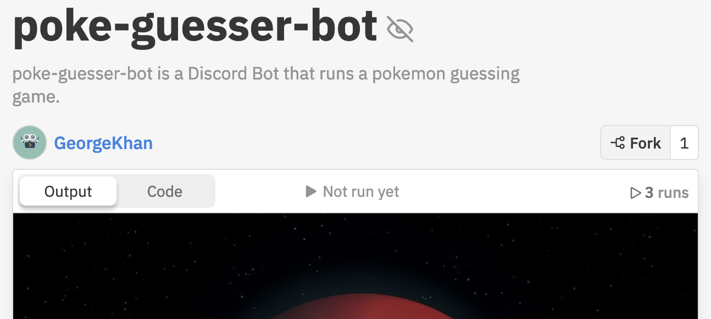
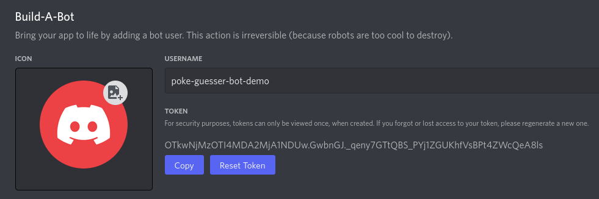
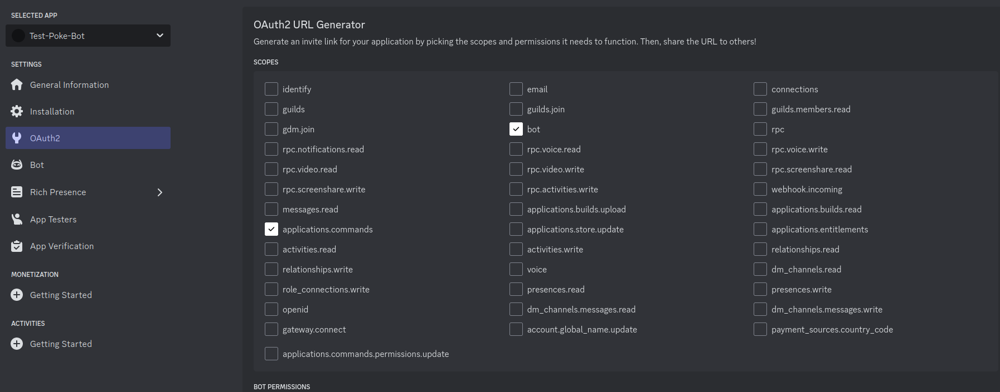
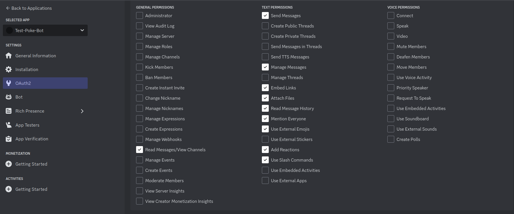

# Poké-guesser Bot

Poké-guesser Bot is a discord bot which selects random pokémon and asks the user to guess the pokémon name. The bot automatically tracks the score of participating users. It also recognizes a number of admin commands, and player commands such as catching pokémon, and displaying the leaderboard. 

## Repositories

Poké-guesser Bot is hosted on Github and Replit. To visit the repositories, see the links below.

1. Github - https://github.com/GeorgeCiesinski/poke-guesser-bot

2. Replit - https://replit.com/@GeorgeKhan/poke-guesser-bot

## Background

A few months ago, one of my friends Pokketmuse reached out to me about a coding idea. She is a Twitch streamer who has a discord server where she runs a few custom events for the users in the channel. One of these events is a Pokémon Guessing game she ran on pen & paper. In a nutshell, the game was to guess a daily pokémon, and the players were tracked on a leaderboard. She wanted a bot that could automate this process.

I fell in love with this idea immediately. I have wanted to build a discord bot for a very long time. I also have wanted to apply my JavaScript knowledge for a while as well as I have not completed any javascript projects yet. This project gave me an opportunity to kill two birds with one stone!

# Features

## Admin Role Configuration

You can set one or more roles to administrate the bot. Setting no roles leaves admin commands and controls open for all server users.

## Channel configuration

You can set which channels the bot is allowed to reply in. Setting no channels allows the bot to listen and reply on all channels.

## Multi-language Support

Poké-guesser Bot supports guesses containing pokemon names in other languages as supported by Poké-API. This makes it great for an international discord server with players from many different regions.

## Dynamic Leaderboard

Poké-guesser Bot keeps track of scores and generates a nice looking leaderboard 

## Player commands

Besides the usual admin commands, there are also many player commands which can be used to get the leaderboard, get their own or another player's score, guess pokemon, and more. 

## Hosted by YOU on Replit

Thanks to this bot being written in Replit, you can clone this and run it yourself so you know exactly what this bot is doing. You can also make any custom modifications you want!

# Usage

## Commands

Poke-guesser bot recognizes commands from Admins and Mods (make sure that you add the role first!) which are for moderating the bot. It also recognizes regular player commands for playing the game.

### Admin Commands

Admin commands have the prefix `!`

Full list of admin commands is shown below. Do not type the < > characters. 

#### Gameplay

`!help`: Shows Admin commands.

`!leaderboard`: Shows a leaderboard of top players.

`!new championship`: (caution) Outputs the Leaderboard one last time, reveals winner, and starts new championship with a blank leaderboard.

#### Score and leaderboard correction

*Note: The below commands require you to use @user mentions*

`!addscore <@user>`: (caution) Adds the user to the leaderboard with 0 points. Cannot be used if the user is already on leaderboard.

`!addscore <@user> <score>`: (caution) Adds the user to the leaderboard and sets their score.

`!removescore <@user>`: (caution) Removes the user from the leaderboard.

`!removescore <@user> <score>`: (caution) Subtracts the given score from the user's current score.

#### Configuration

`!configure`: Shows configure helper.

`!add role <role name>`: Adds the role as a bot moderator. The role name must be exactly what it is in Discord, including any emojis. 

`!remove role <role name>`: Removes the role from bot moderator.

`!add channel <channel name>`: Adds the channel to list of channels the bot replies to. 

`!remove channel <channel name>`: Removes the channel from list of channels the bot replies to.

`!show config`: Shows bot moderator roles and allowed channels.

`!reset config`: Removes all allowed roles and channels. Bot returns to default configuration where all server members are able to send admin commands, and the bot replies in all channels. **Note:** This default configuration should only be used to configure the bot.

### Player Commands

Player commands have the prefix `$`

Full list of player commands is shown below. Do not include the < > characters. 

`$help`: Shows Admin and Player commands. 

`$catch <pokémon-name>`: Allows player to guess the pokémon. Guessing correctly adds the player to the leaderboard and adds one point.

`$leaderboard`: Shows a leaderboard of top players.

`$position`: See your current position.

*Note: The below command requires you to use @user mentions*

`$position <@user>`: See another user's position.

# Installation

## Forking and Running Bot using Replit

This bot was intented to run in [replit](https://replit.com) so my installation instructions will cover this method.

**Important:** *You must have already set up a Discord bot on the Discord Developer portal. If you haven't, follow the instructions in [this](#setup-discord-bot) section first.*

1. Go to the Replit link for the project: https://replit.com/@GeorgeKhan/poke-guesser-bot

3. Click Fork to fork it to your own Replit account.

4. Click the Secrets button (lock icon). Create a new secret with the key `TOKEN` and the value set to your Discord bot token. Click `Add new secret` to finish creating the secret. 

5. Click the **Run** button at the top of the Replit page to start the bot.

## Setup Discord Bot

In order to use Poke-guesser-bot, you need to setup a discord bot first using the Discord Developer Portal.

1. Login to the Discord Developer portal and create a bot using [these instructions](https://discordjs.guide/preparations/setting-up-a-bot-application.html#creating-your-bot).

2. Copy the token by clicking the copy button. Save this for a future step.

3. Click the OAuth2 button, then click bot.

4. Scroll down to the bot permissions. Select the permissions from the below screenshot.

5. Click copy above the bot permissions, and paste it into your browser.

6. Choose a server to invite the bot to, then click authorize.

## Running locally

This bot was written to run on Replit and utilize the Replit Secrets (Environment Variables). I didn't look into this too much to see how well it works in just nodeJS and outside of Replit. 

If running the `index.js` file doesn't work or outputs errors about the TOKEN missing, you will need to update the code to use your local TOKEN variable. 

As this wasn't intended to run locally, I haven't tested this so I can't go into too much detail about how to run the bot this way.

# Technology

## Replit

We used the online IDE [Replit](https://replit.com/~) to create Poke-guesser Bot. The bot is intended to be ran straight from Replit so that it is hosted in the cloud. 

## node.js

This project is written entirely using JavaScript in the [Node.JS](https://nodejs.org/en/) runtime environment. 

## discord.js

All interactions with discord were handled thanks to the [discord.js](https://discord.js.org/#/) library. 

## API

This bot would not be possible without [PokeAPI](https://pokeapi.co/). This API provided a list of all pokémon, including their variants, as well as sprites that were instrumental in building this Poke-guesser Bot. 

# Contributions

To contribute to the bot, please fork this repository and open up a pull request to merge changes back into the repository. 

If your change adds a feature, please include proof that the feature is working as intended. Make sure you also test the bot to ensure other features aren't broken. I will expand this section soon to be more detailed, and add Pull Request templates to follow as well.

# License

[MIT](https://choosealicense.com/licenses/mit/)

# Additional Credit

Code Contributions by [Wissididom](https://github.com/Wissididom)

Replit Cover Image by [PIRO4D](https://pixabay.com/users/piro4d-2707530/) from [Pixabay](https://pixabay.com)

Leaderboard Image by [Aurelia Candeloro](www.instagram.com/aurelia.borealis)
